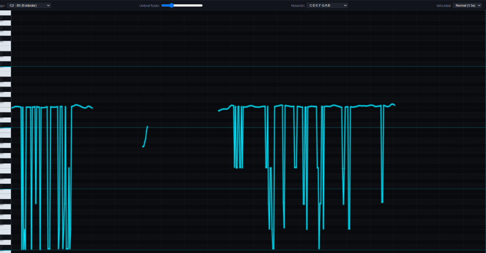

# 🎙️ HtmlVocalPitch — Monitor de Afinación Vocal en Tiempo Real

> Monitor de tono y afinador vocal continuo en tiempo real, 100% autónomo en HTML5, CSS3 y Web Audio API puro (sin librerías externas ni dependencias).

[-ffd600?style=for-the-badge)](#)

---

## 📸 Captura de Pantalla

---

## 🌐 Probar Online (GitHub Pages)

Accede inmediatamente desde cualquier dispositivo sin instalar nada:
👉 **[https://cdcespon.github.io/htmlvocalpitch/](https://cdcespon.github.io/htmlvocalpitch/)**

*(O enlace directo al archivo principal: [HtmlVocalPitch.html](https://cdcespon.github.io/htmlvocalpitch/HtmlVocalPitch.html))*

---

## ✨ Características Principales

- **🎯 Detección de Frecuencia de Alta Precisión (DSP)**:
  - Implementación del algoritmo **MPM (McLeod Pitch Method)** con detección de picos fundamentales y rechazo activo de errores de octava / subarmónicos.
  - **Filtro de mediana temporal** para eliminar fluctuaciones transitorias y mantener una curva de afinación suave y continua a 60 FPS.
  - **Filtros paso-alto y paso-bajo** integrados para eliminar ruidos de fondo y zumbidos de baja frecuencia.
- **🎹 Piano Roll Vertical Interactivo**:
  - Representación visual intuitiva de las notas de la escala musical.
  - Teclas interactivas: haz clic en cualquier tecla para escuchar su tono de referencia.
  - Selección de rangos vocales: Estándar (C2 - B5), Voces Agudas (C3 - B6), Voces Graves (C1 - B4) o Completo (C2 - B6).
- **🎼 Afinador en Centésimas (Cents Meter)**:
  - Muestra la nota actual, la octava y los cents de desviación en tiempo real.
  - Aguja dinámica con feedback de color:
    - 🟢 **Verde**: Afinación exacta (±5 centésimas).
    - 🟡 **Amarillo**: Desviación ligera (±18 centésimas).
    - 🔴 **Rojo**: Desafinado (>18 centésimas).
- **⚙️ Controles y Personalización**:
  - Selección de Notación: **Anglosajona** (C D E F G A B) o **Latina/Solfeo** (Do Re Mi Fa Sol La Si).
  - Control de sensibilidad y umbral de ruido (Noise Gate).
  - Velocidad de desplazamiento del lienzo ajustable (Lento, Normal, Rápido).
  - Botón de **Pausa** y **Limpiar** historial.
  - **Modo Demostración / Simulación**: Prueba la app sin necesidad de micrófono.

---

## 📱 Uso en Teléfonos Móviles (Android e iOS)

En dispositivos móviles, los navegadores (como Chrome y Safari) exigen por seguridad que la página esté servida bajo **HTTPS** para habilitar el hardware del micrófono:

1. Abre el enlace seguro en tu celular: **[https://cdcespon.github.io/htmlvocalpitch/](https://cdcespon.github.io/htmlvocalpitch/)**.
2. Presiona el botón **Comenzar con Micrófono**.
3. Cuando el navegador pregunte: *¿Permitir a este sitio usar el micrófono?*, presiona **Permitir**.
4. ¡Listo! Ya puedes cantar o vocalizar y ver tu afinación en tiempo real.

> 💡 **Tip**: En Chrome de Android o Safari en iPhone, puedes presionar el menú de opciones (tres puntos o botón compartir) y elegir **Añadir a la pantalla de inicio** para usarla como una aplicación nativa a pantalla completa.

---

## 💻 Ejecución Local

Dado que es un archivo 100% autocontenido, no necesitas compilar nada:

1. Clona el repositorio:
   `ash
   git clone https://github.com/cdcespon/htmlvocalpitch.git
   cd htmlvocalpitch
   `
2. Abre HtmlVocalPitch.html directamente en tu navegador (Chrome, Edge, Firefox, Safari).

---

## 🛠️ Tecnologías Utilizadas

- **HTML5** (Semántica y Canvas 2D de alto rendimiento).
- **CSS3** (Tema oscuro profesional, diseño adaptativo y variables modernas).
- **JavaScript Vanilla (ES6+)** (Sin librerías ni frameworks pesados).
- **Web Audio API** (AudioContext, AnalyserNode, BiquadFilterNode).

---

## ℹ️ Acerca de / About

> Desarrollado por **Victoria Cespón** y **Claudio Cespón** para estudiantes o entusiastas del arte de cantar.

---

Desarrollado con ❤️ para cantantes, músicos y educadores vocales.
